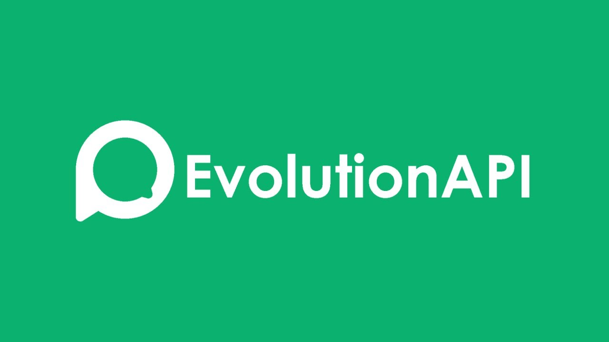

EvoAPI MCP
📸 Interface do Sistema

    
 
 <em>Interface Principal • Configuração no Claude Desktop • Dashboard de Análise Semântica</em> 

Este projeto implementa uma interface de comunicação avançada via FastMCP (Model Context Protocol), permitindo o envio automatizado de mensagens WhatsApp, gerenciamento de mídias e análise semântica de conversas em grupos.

📋 Índice
Funcionalidades
Requisitos
Instalação
Configuração
Uso
API Reference
Solução de Problemas
Contribuição
Licença
🚀 Funcionalidades
📱 Comunicação WhatsApp
✅ Envio de mensagens para grupos e contatos individuais
✅ Suporte completo a mídias (imagens, vídeos, áudios, documentos, PDFs)
✅ Compressão automática de vídeos e áudios
✅ Listagem e gerenciamento de grupos
🤖 Análise Inteligente
✅ Catalogação automática de conversas
✅ Busca semântica em mensagens
✅ Análise de padrões de comunicação
✅ Extração de insights de grupos
🔧 Integração MCP
✅ Compatible com Claude Desktop e Web
✅ Interface via protocolo stdio
✅ Ferramentas expostas automaticamente
📋 Requisitos
Sistema Operacional
Windows 10/11, macOS 10.15+, ou Linux Ubuntu 18.04+
Software Necessário
Python: 3.8 ou superior
FFmpeg: Para processamento de mídia
Node.js: 16+ (para algumas integrações)
Dependências Python
bash
requests>=2.28.0
mcp>=0.5.0
fastapi>=0.100.0
uvicorn>=0.23.0
python-dotenv>=1.0.0
🛠 Instalação
1. Clone o Repositório
bash
git clone https://github.com/sandovalmedeiros/mcp_evoapi.git
cd mcp_evoapi
2. Configuração do Ambiente Python
bash
# Criar ambiente virtual
python -m venv venv

# Ativar ambiente virtual
# Windows
venv\Scripts\activate
# macOS/Linux
source venv/bin/activate

# Instalar dependências
pip install -r requirements.txt
3. Instalação do FFmpeg
Windows
bash
# Via Chocolatey
choco install ffmpeg

# Via Winget
winget install FFmpeg
macOS
bash
# Via Homebrew
brew install ffmpeg
Linux (Ubuntu/Debian)
bash
sudo apt update
sudo apt install ffmpeg
4. Verificação da Instalação
bash
# Verificar Python
python --version

# Verificar FFmpeg
ffmpeg -version

# Verificar dependências
pip list
⚙️ Configuração
1. Variáveis de Ambiente
Copie o arquivo de exemplo e configure suas credenciais:

bash
cp .env.example .env
Edite o arquivo .env:

bash
# Configurações da EVO API
EVO_API_URL=http://localhost:3000
EVO_API_TOKEN=seu_token_aqui
EVO_INSTANCE_NAME=sua_instancia

# Configurações do Serviço de Análise
SEMANTIC_API_URL=http://localhost:8000
SEMANTIC_API_TOKEN=seu_token_semantico

# Configurações de Upload
MAX_FILE_SIZE=160MB
TEMP_DIR=./temp

# Configurações de Compressão
DEFAULT_VIDEO_CRF=28
DEFAULT_VIDEO_RESOLUTION=720p
DEFAULT_AUDIO_BITRATE=128k

# Configurações de Debug
DEBUG=false
LOG_LEVEL=INFO
2. Configuração do Claude Desktop
Crie ou edite o arquivo de configuração do Claude Desktop:

Windows
Localize: %APPDATA%\Claude\claude_desktop_config.json

macOS
Localize: ~/Library/Application Support/Claude/claude_desktop_config.json

Linux
Localize: ~/.config/claude/claude_desktop_config.json

Conteúdo do arquivo claude_desktop_config.json:

json
{
  "mcpServers": {
    "evoapi_mcp": {
      "command": "python",
      "args": [
        "/caminho/completo/para/mcp_evoapi/evoapi_mcp.py"
      ],
      "env": {
        "PYTHONPATH": "/caminho/completo/para/mcp_evoapi",
        "PATH": "/usr/local/bin:/usr/bin:/bin"
      }
    }
  },
  "toolGroups": {
    "whatsapp": {
      "tools": [
        "send_message_to_group",
        "send_message_to_phone",
        "get_groups",
        "get_group_messages"
      ]
    },
    "media": {
      "tools": [
        "send_image",
        "send_video",
        "send_audio",
        "send_document",
        "send_pdf"
      ]
    },
    "analysis": {
      "tools": [
        "catalogar_qas",
        "buscar_qas"
      ]
    }
  }
}
3. Configuração do Claude Web
Para Claude Web, configure o bridge MCP:

bash
# Instalar bridge MCP
npm install -g @anthropic/mcp-bridge

# Executar bridge
mcp-bridge --config claude_desktop_config.json --port 3001
Então, no Claude Web, adicione a ferramenta:

URL: http://localhost:3001
Tipo: MCP Bridge
Configuração: Importar do arquivo JSON
4. Configuração da EVO API
Certifique-se de que a EVO API esteja configurada:

bash
# Verificar status da API
curl -X GET "http://localhost:3000/instance/status" \
  -H "Authorization: Bearer seu_token_aqui"

# Testar conexão WhatsApp
curl -X GET "http://localhost:3000/instance/connect" \
  -H "Authorization: Bearer seu_token_aqui"
🚀 Uso
Execução Direta
bash
git clone https://github.com/sandovalmedeiros/mcp_evoapi.git
cd mcp_evoapi
python evoapi_mcp.py
Exemplos de Uso via Claude
Enviar Mensagem para Grupo
Envie a mensagem "Olá pessoal!" para o grupo "Família"
Enviar Imagem com Legenda
Envie a imagem "foto.jpg" para o contato +5511999999999 com a legenda "Confira esta foto!"
Buscar Mensagens de Grupo
Busque as mensagens do grupo "Trabalho" entre 01/01/2024 e 31/01/2024
Análise Semântica
Catalogue as perguntas e respostas do grupo "Suporte" do último mês e depois busque por "problema de login"
📚 API Reference
Mensagens
send_message_to_group(group_id: str, message: str)
Envia mensagem de texto para um grupo.

Parâmetros:

group_id: ID do grupo WhatsApp
message: Texto da mensagem
send_message_to_phone(cellphone: str, message: str)
Envia mensagem de texto para um contato.

Parâmetros:

cellphone: Número no formato +55XXXXXXXXXXX
message: Texto da mensagem
Mídias
send_image(recipient: str, image_path: str, caption: str = "")
Envia imagem com legenda opcional.

send_video(recipient: str, video_path: str, caption: str = "", crf: int = 28, resolution: str = None, bitrate: str = None)
Envia vídeo com compressão automática.

Parâmetros de Compressão:

crf: Constant Rate Factor (18-51, menor = melhor qualidade)
resolution: Resolução (720p, 1080p, etc.)
bitrate: Taxa de bits (1M, 2M, etc.)
send_audio(recipient: str, audio_path: str, caption: str = "")
Envia áudio com compressão automática.

send_document(recipient: str, document_path: str, caption: str = "")
Envia documento genérico.

send_pdf(recipient: str, pdf_path: str, caption: str = "")
Envia arquivo PDF.

Grupos
get_groups()
Lista todos os grupos disponíveis.

Retorno:

json
[
  {
    "id": "grupo_id",
    "name": "Nome do Grupo",
    "participants": 25
  }
]
get_group_messages(group_id: str, start_date: str, end_date: str)
Recupera mensagens de um grupo em período específico.

Parâmetros:

start_date: Data início (YYYY-MM-DD)
end_date: Data fim (YYYY-MM-DD)
Análise Semântica
catalogar_qas(group_id: str, start_date: str, end_date: str)
Envia mensagens para análise e catalogação.

buscar_qas(consulta: str, top_k: int = 3)
Realiza busca semântica nas mensagens catalogadas.

🔧 Solução de Problemas
Problemas Comuns
1. Erro "FFmpeg não encontrado"
bash
# Verificar instalação
which ffmpeg  # macOS/Linux
where ffmpeg  # Windows

# Adicionar ao PATH se necessário
export PATH=$PATH:/usr/local/bin  # macOS/Linux
2. Erro de Permissão
bash
# Dar permissão de execução
chmod +x evoapi_mcp.py

# Verificar proprietário
ls -la evoapi_mcp.py
3. Erro de Dependências
bash
# Reinstalar dependências
pip install --force-reinstall -r requirements.txt

# Verificar versões
pip show mcp requests fastapi
4. Problemas de Conexão
bash
# Testar conectividade
curl -X GET http://localhost:3000/health
curl -X GET http://localhost:8000/health

# Verificar portas em uso
netstat -tulpn | grep :3000
netstat -tulpn | grep :8000
Logs e Debug
Para ativar logs detalhados:

bash
# Definir nível de log
export LOG_LEVEL=DEBUG

# Executar com verbose
python evoapi_mcp.py --verbose

# Verificar logs
tail -f logs/evoapi_mcp.log
Arquivos de Configuração
Verificar Configuração do Claude Desktop
bash
# Validar JSON
python -m json.tool claude_desktop_config.json

# Verificar sintaxe
cat claude_desktop_config.json | jq .
Verificar Variáveis de Ambiente
bash
# Listar variáveis
printenv | grep EVO
printenv | grep SEMANTIC

# Testar carregamento
python -c "from dotenv import load_dotenv; load_dotenv(); import os; print(os.getenv('EVO_API_URL'))"
🤝 Contribuição
Como Contribuir
Fork o repositório
Clone sua cópia local
Crie uma branch para sua feature (git checkout -b feature/AmazingFeature)
Commit suas mudanças (git commit -m 'Add some AmazingFeature')
Push para a branch (git push origin feature/AmazingFeature)
Abra um Pull Request
Padrões de Código
Use PEP 8 para formatação Python
Adicione docstrings para todas as funções
Inclua testes unitários para novas funcionalidades
Mantenha compatibilidade com Python 3.8+
Reportar Bugs
Use o template de issue do GitHub incluindo:

Descrição detalhada do problema
Passos para reproduzir
Ambiente (OS, Python version, etc.)
Logs relevantes
📄 Licença
Este projeto está licenciado sob a Licença MIT - veja o arquivo LICENSE para detalhes.

📞 Suporte
Documentação: Wiki do Projeto
Issues: GitHub Issues
Discussões: GitHub Discussions
🙏 Agradecimentos
Agradecimento especial ao Professor Sandeco Macedo pelo fornecimento das classes fundamentais e pelos valiosos ensinamentos que tornaram este projeto possível.

🎓 Canal do Professor Sandeco Macedo: YouTube

Desenvolvido com ❤️ pela equipe EvoAPI

